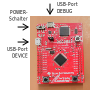

************
Vorbereitung
************

Das Launchpad hat zwei USB-Anschlüsse, einen für das Programmieren und Testen
der Firmware (DEBUG) und einen für die Kommunikation zwischen der Firmware und
Lenlab auf dem Computer (DEVICE). Der POWER-Schalter wählt, von welchem
USB-Anschluss die Versorgungsspannung bezogen wird. Wenn die Stromversorgung
eingeschaltet ist, leuchtet die grüne POWER-LED, die sich neben dem
POWER-Schalter befindet.

Flashen der Firmware
====================

Lenlab benötigt eine eigene Firmware auf dem LaunchPad. Das LaunchPad besitzt
ein integriertes Programmiergerät, um die Firmware in den Microcontroller zu
laden. Das Programm `Uniflash <https://www.ti.com/tool/UNIFLASH>`_ von Texas
Instruments kann dieses Programmiergerät ansprechen.

Das Programmiergerät befindet sich auf der Oberseite des Launchpad und hat dort
einen eigenen USB-Anschluss, der mit DEBUG beschriftet ist. Zum Programmieren bitte
den DEBUG-Anschluss an der schmalen Seite des Launchpad mit dem Computer verbinden
und den Power-Schalter ebenfalls auf DEBUG umstellen. Das Launchpad wird dann
über den DEBUG-Anschluss mit Strom versorgt und die grüne Power-LED leuchtet.

Das Lenlab-Softwarepaket für Windows enthält eine Kopie von Uniflash für
64-bit Systeme, z.B. die meisten Windows 8 und 10. Die Anleitung dafür befindet
im folgenden Abschnitt `Windows 64-bit Systeme`. Für andere Betriebssysteme oder
Windows 32-bit Systeme erhalten Sie Uniflash direkt von Texas Instruments und
eine Anleitung zur Verwendung im Abschnitt `Andere Systeme`.

Windows 64-bit Systeme
----------------------

Im Unterverzeichnis `uniflash_windows_64` im Lenlab-Softwarepaket befindet sich
das Programm zum Flashen der Firmware mit fertig eingestellten Parametern für
die Lenlab Firmware und das LaunchPad.

* Öffnen Sie das Verzeichnis `uniflash_windows_64` im Explorer.
* Installieren Sie die Treiber durch Starten der `one_time_setup.bat`. Das ist
  pro Computer nur einmal nötig.
* Starten Sie die Programmierung mit der Datei `dslite.bat`. Die Programmierung
  dauert ein bisschen. Wenn das Fenster von dslite.bat sofort
  wieder verschwindet, ist es schief gegangen. Wenn in dem Fenster in der
  letzten Zeile für kurze Zeit "Erasing Flash." zu lesen war, dann nochmal
  neuer Text auftauchte und das Fenster dann verschwand, ist die Programmierung
  vermutlich gelungen.

Andere Systeme
--------------

Laden Sie `Uniflash <https://www.ti.com/tool/UNIFLASH>`_ von Texas Instruments
herunter, installieren Sie es und starten Sie es.

* Wählen Sie EK-TM4C123GXL (Launchpad) bei "Choose your device".
* Stellaris In-Circuit Debug Interface ist richtig
* Browse, wählen Sie das passende Firmware Binary aus dem Lenlab-Softwarepaket,
  Unterverzeichnis `firmware`.
* Starten Sie die Programmierung mit "Load Image".

Lenlab ausführen
================

Das PC Programm befindet sich im Unterordner `lenlab`. Starten Sie `lenlab.exe`.

Verbinden Sie den DEVICE USB-Anschluss an der Seite des Launchpad mit dem Computer.
Stellen Sie den Power-Schalter auf DEVICE. Die grüne Power-LED leuchtet.

Lenlab sucht nach dem Board und verbindet sich, wenn es eines findet. Es meldet
dann im Nachrichten-Fenster "Lenlab-Board verbunden."
